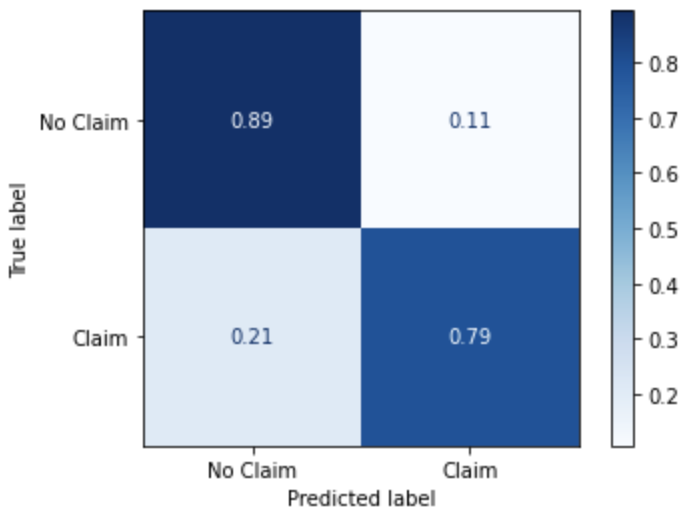

# Car Insurance Classification

Numann Malik

## Project Summary

We analyzed behavioral data for the customers of a car insurance company. The goal was to identify key factors that are more likely to lead a customer to filing an insurance claim (e.g. for an accident). Our stakeholder would want to determine in particular, which customers are more accident prone and hence likely to file a claim, and hence either raise their premiums or consider denying them coverage (so as to maximize their profits or minimize their losses).

## Technical Objectives
After appropristely cleaning and preprocessing the dataset, we employed several models:
- Decision Tree Classification
- Random Forest Classification
- K-Nearest Neighbors Algorithm (plus Principal Component Analysis)
- Logistic Regression (plus Principal Component Analysis)
- Gradient Boosting
- LightGBM
- XGBoost
We evaluated each of the above models with multiple metrics
- Accuracy score
- Precision score
- Recall score
- f1 score

## Key Visual Observations

Above we see that over 80% of customers who have never made an insurance claim owned their vehicle, while less than half have made a claim - supporting evidence that those who lease their vehicles are more likely to file claims with their insurance company.

From the above we can see there is a positive correlation between the number of past accidents and speeding violations. This would indicate that we should determine both for each potential customer before deciding to grant any coverage.

## Model Development and Evaluation

- Our stakeholder, the car insurance company, will want the model that minimizes the proportion of false negatives.
- The reason is that it will cost more money to pay out for claims that were not accurately predicted.
- Therefore, we mostly we care about the recall score.

## Recommendations
- The model with the best recall score is our tuned LightGBM with 79%, i.e. 79% of customers who file claims will have been predicted to correctly, with test accuracy of 86.2%.
- We also find relatively high precision (which minimizes false positives). This is interpreted as accurately predicting when customers do not file a claim. This reassures us that the insurance company can reliably pick customers who will continue to pay premiums, while not costing the insurance company more money with claims.
- Finally, the insurance company should scrutinize potential customers more who lease (or who otherwise don't own) their vehicles, as well as those who have a history of speeding violations and accidents.
